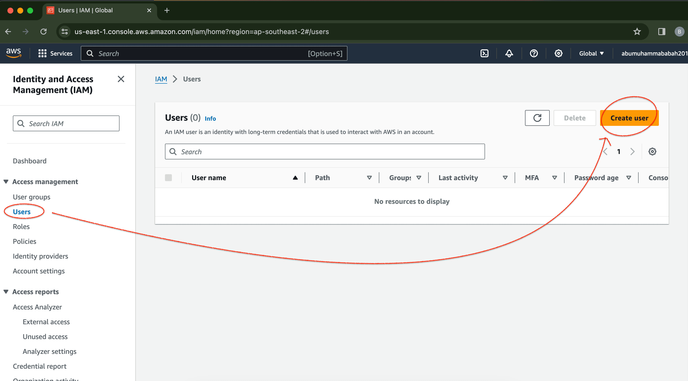
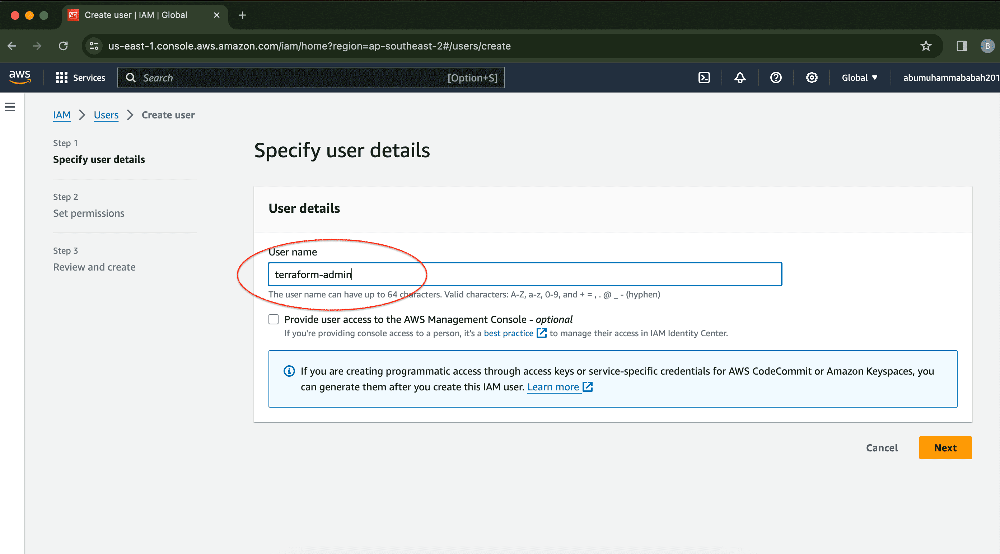
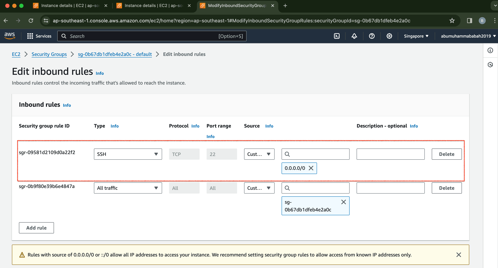
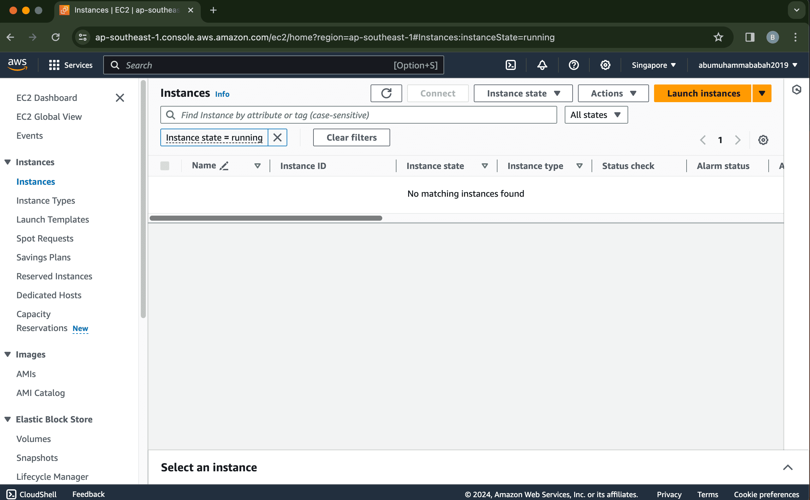

# Terraform : aws provider create ec2 instance (beginner)

&nbsp;
  
&nbsp;
  
**Reference :** 
<!-- - YT | How to Create EC2 instance using Terraform | Step By Step Tutorials | latest
  <pre>https://www.youtube.com/watch?v=eBW0MWOBwe0</pre> -->

- Docs | AWS Provider
  <pre>https://registry.terraform.io/providers/hashicorp/aws/latest/docs</pre>

- Docs | tls private key
  <pre>https://registry.terraform.io/providers/hashicorp/tls/latest/docs/resources/private_key</pre>

- Docs | aws resource key pair
  <pre>https://registry.terraform.io/providers/hashicorp/aws/latest/docs/resources/key_pair</pre>

- Docs | aws instance
  <pre>https://registry.terraform.io/providers/hashicorp/aws/latest/docs/resources/instance</pre>

&nbsp;

&nbsp;

### &#x1F530; Stages in the AWS service management console

    

 

    

 

&nbsp;

&nbsp;

File structure :
<pre>
    ❯ tree -L 4 -a -I 'README.md|.DS_Store|.git|.gitignore|gambar-petunjuk|.terraform|*.hcl|*.tfstate|*.tfstate.backup' ./

        ├── main.tf
        ├── secret.tfvars
        └── variables.tf
</pre>

&nbsp;

&nbsp;

---

&nbsp;

**ATTENTION ! :**  

**Reference :** 
- Docs | OpenSSL
  <pre>https://shorturl.at/dD357</pre>

&nbsp;

**OpenSSL usage example :** 
  [Encryption]

     ❯  openssl aes-256-cbc -e -a -salt -pbkdf2 -in ./secret.tfvars -out ./secret.tfvars.enc

  [Description]  
  In this case, I encrypted the `secret.tfvars` file to maintain secure access. If you want to do a description of the file, here is the applied command :

     ❯  openssl aes-256-cbc -d -a -salt -pbkdf2 -in ./secret.tfvars.enc -out ./secret.tfvars

&nbsp;

---
    
&nbsp;

&nbsp;

### &#x1F530; Code : 
<pre>
    ❯ vim main.tf

            terraform {
              required_providers {
                aws = {
                  source  = "hashicorp/aws"
                  version = "~> 5.0"
                }
              }
            }
            
            provider "aws" {
              region     = "ap-southeast-1"
              access_key = var.aws_access_key
              secret_key = var.aws_secret_key
            
            }
            
            resource "tls_private_key" "rsa_4096" {
              algorithm = "RSA"
              rsa_bits  = 4096
            }
            
            variable "key_name" {
            
            }
            
            resource "aws_key_pair" "key_pair" {
              key_name   = var.key_name
              public_key = tls_private_key.rsa_4096.public_key_openssh
            }
            
            resource "local_file" "private_key" {
              content  = tls_private_key.rsa_4096.private_key_pem
              filename = var.key_name
            }
            
            resource "aws_instance" "public_intance" {
              ami           = "ami-06c4be2792f419b7b"
              instance_type = "t3.micro"
              key_name      = aws_key_pair.key_pair.key_name
            
              tags = {
                Name = "public_instance"
              }
            }
</pre>

<pre>
    ❯ vim variables.tf

            variable "aws_access_key" {
              type        = string
              description = "AWS Access Key"
              sensitive   = true
            }
            
            variable "aws_secret_key" {
              type        = string
              description = "AWS Secret Key"
              sensitive   = true
            }
</pre>

&nbsp;

&nbsp;

### &#x1F530; TERRAFORM STAGES :

<pre>
    ❯ terraform init -upgrade

            Initializing the backend...

            Initializing provider plugins...
            - Finding hashicorp/aws versions matching "~> 5.0"...
            - Finding latest version of hashicorp/tls...
            - Finding latest version of hashicorp/local...
            - Installing hashicorp/tls v4.0.5...
            - Installed hashicorp/tls v4.0.5 (signed by HashiCorp)
            - Installing hashicorp/local v2.5.1...
            - Installed hashicorp/local v2.5.1 (signed by HashiCorp)
            - Using previously-installed hashicorp/aws v5.45.0

            Terraform has made some changes to the provider dependency selections recorded
            in the .terraform.lock.hcl file. Review those changes and commit them to your
            version control system if they represent changes you intended to make.

            Terraform has been successfully initialized!

            You may now begin working with Terraform. Try running "terraform plan" to see
            any changes that are required for your infrastructure. All Terraform commands
            should now work.

            If you ever set or change modules or backend configuration for Terraform,
            rerun this command to reinitialize your working directory. If you forget, other
            commands will detect it and remind you to do so if necessary.

</pre>

&nbsp;

<pre>
    ❯ terraform fmt

    ❯ terraform validate
            Success! The configuration is valid.
</pre>

&nbsp;

<pre>
    ❯ terraform plan -var-file=./secret.tfvars

            var.key_name
            Enter a value: codebaba_pem

            Terraform used the selected providers to generate the following execution plan. Resource actions are indicated with the following symbols:
            + create

            Terraform will perform the following actions:

            # aws_instance.public_intance will be created
            + resource "aws_instance" "public_intance" {
                + ami                                  = "ami-06c4be2792f419b7b"
                + arn                                  = (known after apply)
                + associate_public_ip_address          = (known after apply)
                + availability_zone                    = (known after apply)
                + cpu_core_count                       = (known after apply)
                + cpu_threads_per_core                 = (known after apply)
                + disable_api_stop                     = (known after apply)
                + disable_api_termination              = (known after apply)
                + ebs_optimized                        = (known after apply)
                + get_password_data                    = false
                + host_id                              = (known after apply)
                + host_resource_group_arn              = (known after apply)
                + iam_instance_profile                 = (known after apply)
                + id                                   = (known after apply)
                + instance_initiated_shutdown_behavior = (known after apply)
                + instance_lifecycle                   = (known after apply)
                + instance_state                       = (known after apply)
                + instance_type                        = "t3.micro"
                + ipv6_address_count                   = (known after apply)
                + ipv6_addresses                       = (known after apply)
                + key_name                             = "codebaba_pem"
                + monitoring                           = (known after apply)
                + outpost_arn                          = (known after apply)
                + password_data                        = (known after apply)
                + placement_group                      = (known after apply)
                + placement_partition_number           = (known after apply)
                + primary_network_interface_id         = (known after apply)
                + private_dns                          = (known after apply)
                + private_ip                           = (known after apply)
                + public_dns                           = (known after apply)
                + public_ip                            = (known after apply)
                + secondary_private_ips                = (known after apply)
                + security_groups                      = (known after apply)
                + source_dest_check                    = true
                + spot_instance_request_id             = (known after apply)
                + subnet_id                            = (known after apply)
                + tags                                 = {
                    + "Name" = "public_instance"
                    }
                + tags_all                             = {
                    + "Name" = "public_instance"
                    }
                + tenancy                              = (known after apply)
                + user_data                            = (known after apply)
                + user_data_base64                     = (known after apply)
                + user_data_replace_on_change          = false
                + vpc_security_group_ids               = (known after apply)
                }

            # aws_key_pair.key_pair will be created
            + resource "aws_key_pair" "key_pair" {
                + arn             = (known after apply)
                + fingerprint     = (known after apply)
                + id              = (known after apply)
                + key_name        = "codebaba_pem"
                + key_name_prefix = (known after apply)
                + key_pair_id     = (known after apply)
                + key_type        = (known after apply)
                + public_key      = (known after apply)
                + tags_all        = (known after apply)
                }

            # local_file.private_key will be created
            + resource "local_file" "private_key" {
                + content              = (sensitive value)
                + content_base64sha256 = (known after apply)
                + content_base64sha512 = (known after apply)
                + content_md5          = (known after apply)
                + content_sha1         = (known after apply)
                + content_sha256       = (known after apply)
                + content_sha512       = (known after apply)
                + directory_permission = "0777"
                + file_permission      = "0777"
                + filename             = "codebaba_pem"
                + id                   = (known after apply)
                }

            # tls_private_key.rsa_4096 will be created
            + resource "tls_private_key" "rsa_4096" {
                + algorithm                     = "RSA"
                + ecdsa_curve                   = "P224"
                + id                            = (known after apply)
                + private_key_openssh           = (sensitive value)
                + private_key_pem               = (sensitive value)
                + private_key_pem_pkcs8         = (sensitive value)
                + public_key_fingerprint_md5    = (known after apply)
                + public_key_fingerprint_sha256 = (known after apply)
                + public_key_openssh            = (known after apply)
                + public_key_pem                = (known after apply)
                + rsa_bits                      = 4096
                }

            Plan: 4 to add, 0 to change, 0 to destroy.

            ────────────────────────────────────────────────────────────────────────────────────────────────────────────────────────────────────────────────────────────────────────────────────────────────────────────

            Note: You didn't use the -out option to save this plan, so Terraform can't guarantee to take exactly these actions if you run "terraform apply" now.
</pre>

&nbsp;

<pre>
    ❯ terraform apply -var-file=./secret.tfvars

            var.key_name
            Enter a value: codebaba_pem

            Terraform used the selected providers to generate the following execution plan. Resource actions are indicated with the following symbols:
            + create

            Terraform will perform the following actions:

            # aws_instance.public_intance will be created
            + resource "aws_instance" "public_intance" {
                + ami                                  = "ami-06c4be2792f419b7b"
                + arn                                  = (known after apply)
                + associate_public_ip_address          = (known after apply)
                + availability_zone                    = (known after apply)
                + cpu_core_count                       = (known after apply)
                + cpu_threads_per_core                 = (known after apply)
                + disable_api_stop                     = (known after apply)
                + disable_api_termination              = (known after apply)
                + ebs_optimized                        = (known after apply)
                + get_password_data                    = false
                + host_id                              = (known after apply)
                + host_resource_group_arn              = (known after apply)
                + iam_instance_profile                 = (known after apply)
                + id                                   = (known after apply)
                + instance_initiated_shutdown_behavior = (known after apply)
                + instance_lifecycle                   = (known after apply)
                + instance_state                       = (known after apply)
                + instance_type                        = "t3.micro"
                + ipv6_address_count                   = (known after apply)
                + ipv6_addresses                       = (known after apply)
                + key_name                             = "codebaba_pem"
                + monitoring                           = (known after apply)
                + outpost_arn                          = (known after apply)
                + password_data                        = (known after apply)
                + placement_group                      = (known after apply)
                + placement_partition_number           = (known after apply)
                + primary_network_interface_id         = (known after apply)
                + private_dns                          = (known after apply)
                + private_ip                           = (known after apply)
                + public_dns                           = (known after apply)
                + public_ip                            = (known after apply)
                + secondary_private_ips                = (known after apply)
                + security_groups                      = (known after apply)
                + source_dest_check                    = true
                + spot_instance_request_id             = (known after apply)
                + subnet_id                            = (known after apply)
                + tags                                 = {
                    + "Name" = "public_instance"
                    }
                + tags_all                             = {
                    + "Name" = "public_instance"
                    }
                + tenancy                              = (known after apply)
                + user_data                            = (known after apply)
                + user_data_base64                     = (known after apply)
                + user_data_replace_on_change          = false
                + vpc_security_group_ids               = (known after apply)
                }

            # aws_key_pair.key_pair will be created
            + resource "aws_key_pair" "key_pair" {
                + arn             = (known after apply)
                + fingerprint     = (known after apply)
                + id              = (known after apply)
                + key_name        = "codebaba_pem"
                + key_name_prefix = (known after apply)
                + key_pair_id     = (known after apply)
                + key_type        = (known after apply)
                + public_key      = (known after apply)
                + tags_all        = (known after apply)
                }

            # local_file.private_key will be created
            + resource "local_file" "private_key" {
                + content              = (sensitive value)
                + content_base64sha256 = (known after apply)
                + content_base64sha512 = (known after apply)
                + content_md5          = (known after apply)
                + content_sha1         = (known after apply)
                + content_sha256       = (known after apply)
                + content_sha512       = (known after apply)
                + directory_permission = "0777"
                + file_permission      = "0777"
                + filename             = "codebaba_pem"
                + id                   = (known after apply)
                }

            # tls_private_key.rsa_4096 will be created
            + resource "tls_private_key" "rsa_4096" {
                + algorithm                     = "RSA"
                + ecdsa_curve                   = "P224"
                + id                            = (known after apply)
                + private_key_openssh           = (sensitive value)
                + private_key_pem               = (sensitive value)
                + private_key_pem_pkcs8         = (sensitive value)
                + public_key_fingerprint_md5    = (known after apply)
                + public_key_fingerprint_sha256 = (known after apply)
                + public_key_openssh            = (known after apply)
                + public_key_pem                = (known after apply)
                + rsa_bits                      = 4096
                }

            Plan: 4 to add, 0 to change, 0 to destroy.

            Do you want to perform these actions?
            Terraform will perform the actions described above.
            Only 'yes' will be accepted to approve.

            Enter a value: yes

            tls_private_key.rsa_4096: Creating...
            tls_private_key.rsa_4096: Creation complete after 1s [id=15eeaea7900ec72723fa80f88b783d767a8225ee]
            aws_key_pair.key_pair: Creating...
            local_file.private_key: Creating...
            local_file.private_key: Creation complete after 0s [id=3af4c0ce8de440a79175b81e85ebcef589f72288]
            aws_key_pair.key_pair: Creation complete after 1s [id=codebaba_pem]
            aws_instance.public_intance: Creating...
            aws_instance.public_intance: Still creating... [10s elapsed]
            aws_instance.public_intance: Creation complete after 12s [id=i-0837545e9eb1089c8]

            Apply complete! Resources: 4 added, 0 changed, 0 destroyed.
</pre>

&nbsp;

&nbsp;

### &#x1F530; SSH 

    

 

<pre>
    ❯ sudo ssh -i "./codebaba_pem" ubuntu@ec2-47-128-225-21.ap-southeast-1.compute.amazonaws.com

            Password:
            The authenticity of host 'ec2-47-128-225-21.ap-southeast-1.compute.amazonaws.com (47.128.225.21)' can't be established.
            ED25519 key fingerprint is SHA256:hYXwoiKbD95xtv7h1DpMgKS20NwniyCn44Q2D9k6La4.
            This key is not known by any other names
            Are you sure you want to continue connecting (yes/no/[fingerprint])? yes
            Warning: Permanently added 'ec2-47-128-225-21.ap-southeast-1.compute.amazonaws.com' (ED25519) to the list of known hosts.
            Welcome to Ubuntu 22.04.4 LTS (GNU/Linux 6.5.0-1014-aws x86_64)

            * Documentation:  https://help.ubuntu.com
            * Management:     https://landscape.canonical.com
            * Support:        https://ubuntu.com/pro

            System information as of Sat Apr 13 01:07:31 UTC 2024

            System load:  0.0               Processes:             98
            Usage of /:   20.4% of 7.57GB   Users logged in:       0
            Memory usage: 22%               IPv4 address for ens5: 172.31.41.145
            Swap usage:   0%

            Expanded Security Maintenance for Applications is not enabled.

            0 updates can be applied immediately.

            Enable ESM Apps to receive additional future security updates.
            See https://ubuntu.com/esm or run: sudo pro status

            The list of available updates is more than a week old.
            To check for new updates run: sudo apt update

            The programs included with the Ubuntu system are free software;
            the exact distribution terms for each program are described in the
            individual files in /usr/share/doc/*/copyright.

            Ubuntu comes with ABSOLUTELY NO WARRANTY, to the extent permitted by
            applicable law.

            To run a command as administrator (user "root"), use "sudo <command>".
            See "man sudo_root" for details.

            ubuntu@ip-172-31-41-145:~$ ls -lah
            total 28K
            drwxr-x--- 4 ubuntu ubuntu 4.0K Apr 13 01:07 .
            drwxr-xr-x 3 root   root   4.0K Apr 13 00:55 ..
            -rw-r--r-- 1 ubuntu ubuntu  220 Jan  6  2022 .bash_logout
            -rw-r--r-- 1 ubuntu ubuntu 3.7K Jan  6  2022 .bashrc
            drwx------ 2 ubuntu ubuntu 4.0K Apr 13 01:07 .cache
            -rw-r--r-- 1 ubuntu ubuntu  807 Jan  6  2022 .profile
            drwx------ 2 ubuntu ubuntu 4.0K Apr 13 00:55 .ssh
</pre>

&nbsp;

&nbsp;

---

### &#x1F530; Destroy
<pre>
    ❯ terraform destroy -var-file=./secret.tfvars

            var.key_name
            Enter a value: codebaba_pem

            tls_private_key.rsa_4096: Refreshing state... [id=15eeaea7900ec72723fa80f88b783d767a8225ee]
            local_file.private_key: Refreshing state... [id=3af4c0ce8de440a79175b81e85ebcef589f72288]
            aws_key_pair.key_pair: Refreshing state... [id=codebaba_pem]
            aws_instance.public_intance: Refreshing state... [id=i-0837545e9eb1089c8]

            Terraform used the selected providers to generate the following execution plan. Resource actions are indicated with the following symbols:
            - destroy

            Terraform will perform the following actions:

            # aws_instance.public_intance will be destroyed
            - resource "aws_instance" "public_intance" {
                - ami                                  = "ami-06c4be2792f419b7b" -> null
                - arn                                  = "arn:aws:ec2:ap-southeast-1:730335453692:instance/i-0837545e9eb1089c8" -> null
                - associate_public_ip_address          = true -> null
                - availability_zone                    = "ap-southeast-1a" -> null
                - cpu_core_count                       = 1 -> null
                - cpu_threads_per_core                 = 2 -> null
                - disable_api_stop                     = false -> null
                - disable_api_termination              = false -> null
                - ebs_optimized                        = false -> null
                - get_password_data                    = false -> null
                - hibernation                          = false -> null
                - id                                   = "i-0837545e9eb1089c8" -> null
                - instance_initiated_shutdown_behavior = "stop" -> null
                - instance_state                       = "running" -> null
                - instance_type                        = "t3.micro" -> null
                - ipv6_address_count                   = 0 -> null
                - ipv6_addresses                       = [] -> null
                - key_name                             = "codebaba_pem" -> null
                - monitoring                           = false -> null
                - placement_partition_number           = 0 -> null
                - primary_network_interface_id         = "eni-052a574b4bba087e0" -> null
                - private_dns                          = "ip-172-31-41-145.ap-southeast-1.compute.internal" -> null
                - private_ip                           = "172.31.41.145" -> null
                - public_dns                           = "ec2-47-128-225-21.ap-southeast-1.compute.amazonaws.com" -> null
                - public_ip                            = "47.128.225.21" -> null
                - secondary_private_ips                = [] -> null
                - security_groups                      = [
                    - "default",
                    ] -> null
                - source_dest_check                    = true -> null
                - subnet_id                            = "subnet-0e59132ad7bf880bb" -> null
                - tags                                 = {
                    - "Name" = "public_instance"
                    } -> null
                - tags_all                             = {
                    - "Name" = "public_instance"
                    } -> null
                - tenancy                              = "default" -> null
                - user_data_replace_on_change          = false -> null
                - vpc_security_group_ids               = [
                    - "sg-0b67db1dfeb4e2a0c",
                    ] -> null

                - capacity_reservation_specification {
                    - capacity_reservation_preference = "open" -> null
                    }

                - cpu_options {
                    - core_count       = 1 -> null
                    - threads_per_core = 2 -> null
                    }

                - credit_specification {
                    - cpu_credits = "unlimited" -> null
                    }

                - enclave_options {
                    - enabled = false -> null
                    }

                - maintenance_options {
                    - auto_recovery = "default" -> null
                    }

                - metadata_options {
                    - http_endpoint               = "enabled" -> null
                    - http_protocol_ipv6          = "disabled" -> null
                    - http_put_response_hop_limit = 1 -> null
                    - http_tokens                 = "optional" -> null
                    - instance_metadata_tags      = "disabled" -> null
                    }

                - private_dns_name_options {
                    - enable_resource_name_dns_a_record    = false -> null
                    - enable_resource_name_dns_aaaa_record = false -> null
                    - hostname_type                        = "ip-name" -> null
                    }

                - root_block_device {
                    - delete_on_termination = true -> null
                    - device_name           = "/dev/sda1" -> null
                    - encrypted             = false -> null
                    - iops                  = 100 -> null
                    - tags                  = {} -> null
                    - tags_all              = {} -> null
                    - throughput            = 0 -> null
                    - volume_id             = "vol-0d844f6c3a481a05e" -> null
                    - volume_size           = 8 -> null
                    - volume_type           = "gp2" -> null
                    }
                }

            # aws_key_pair.key_pair will be destroyed
            - resource "aws_key_pair" "key_pair" {
                - arn         = "arn:aws:ec2:ap-southeast-1:730335453692:key-pair/codebaba_pem" -> null
                - fingerprint = "3f:9e:d3:94:ed:c6:15:ed:be:e2:40:fe:54:78:34:43" -> null
                - id          = "codebaba_pem" -> null
                - key_name    = "codebaba_pem" -> null
                - key_pair_id = "key-0700df1d57c611dd0" -> null
                - key_type    = "rsa" -> null
                - public_key  = "ssh-rsa AAAAB3NzaC1yc2EAAAADAQABAAACAQC7jO/G/PKYuLP5XkH4hAok/vjesGGHOXX0rsqtrgqMj0mYPFqXH2q9hcN3uOsPrJdCJ4+PsFRctFH6KL3dMS7/70++4yhBLc+qPUh13XqGGNxvKNcf7x/yBqIQxfCXhIhOz5w1Z9rbEGVSjTYsHszflMOYtyup9UGsRgVHTUQ2Y4WSyxRl/k0Kl98JkH/WHImNhM7katunM0rwifPN3am+exX7bKhhEV3n4LNRqakxsbFL90EuwcxQahWRNmBvewPLFI/hgkJKTiEpoNp64YAOb0iFVpVW/nS/45VJG5xdOgKmsTr7rsWjzBhwIoKhPdLD3dkgzPnQEbcV2318FOEl5ptkI8HfyP824mSCJbVoq2zQ6z/mSzPgGKQuqNd+vgRVLAMg5YdTXeUmK9uEnVJGmhHR5vCWICdo/Kx98ZVfuT4L5kCxxDhA6SCapgYGgwRs9iW+XdPG+nuV+okccRatUROsFkiI51V8xdsksZHxTuFzTYwVZjmaffNxViWI7dSvizZJWFFjIWc47MSbeutonv0a52FIR9kmrbo/8QTqWCIxo2hLUyWHz0EUhWM6HwCl8A9kyEO3cCTzYVtDpb3s8g/Cb5tZWtrAmf65fkJlmE08d+kBQr9Nc7c1tlcQYY1EyFylcVgrtuMo/q1pwOFWY+KQMHBAlvPOEI1kVdZpNQ==" -> null
                - tags        = {} -> null
                - tags_all    = {} -> null
                }

            # local_file.private_key will be destroyed
            - resource "local_file" "private_key" {
                - content              = (sensitive value) -> null
                - content_base64sha256 = "wYy3Os7MvzlJW9Uk4cFal5ZNnaP010DBYWNzUlFU7vM=" -> null
                - content_base64sha512 = "0T+FwQDYk12oXtEgtHR02FshQX2LrUW6wamBhz4/vez7Hx2jnfA/25uIk+CzEEAmRBgWdIN6EZUEwv03jaFKXw==" -> null
                - content_md5          = "6dc8423b5dd6fd52817e6ebca3219fc7" -> null
                - content_sha1         = "3af4c0ce8de440a79175b81e85ebcef589f72288" -> null
                - content_sha256       = "c18cb73aceccbf39495bd524e1c15a97964d9da3f4d740c1616373525154eef3" -> null
                - content_sha512       = "d13f85c100d8935da85ed120b47474d85b21417d8bad45bac1a981873e3fbdecfb1f1da39df03fdb9b8893e0b310402644181674837a119504c2fd378da14a5f" -> null
                - directory_permission = "0777" -> null
                - file_permission      = "0777" -> null
                - filename             = "codebaba_pem" -> null
                - id                   = "3af4c0ce8de440a79175b81e85ebcef589f72288" -> null
                }

            # tls_private_key.rsa_4096 will be destroyed
            - resource "tls_private_key" "rsa_4096" {
                - algorithm                     = "RSA" -> null
                - ecdsa_curve                   = "P224" -> null
                - id                            = "15eeaea7900ec72723fa80f88b783d767a8225ee" -> null
                - private_key_openssh           = (sensitive value) -> null
                - private_key_pem               = (sensitive value) -> null
                - private_key_pem_pkcs8         = (sensitive value) -> null
                - public_key_fingerprint_md5    = "1b:cd:40:3c:be:9b:6a:03:94:50:1c:67:e2:f5:e2:0d" -> null
                - public_key_fingerprint_sha256 = "SHA256:bS+bY1SS9zHVi/2lXa5MKrPBZIvZR1Ix02uQAiUduQs" -> null
                - public_key_openssh            = <<-EOT
                        ssh-rsa AAAAB3NzaC1yc2EAAAADAQABAAACAQC7jO/G/PKYuLP5XkH4hAok/vjesGGHOXX0rsqtrgqMj0mYPFqXH2q9hcN3uOsPrJdCJ4+PsFRctFH6KL3dMS7/70++4yhBLc+qPUh13XqGGNxvKNcf7x/yBqIQxfCXhIhOz5w1Z9rbEGVSjTYsHszflMOYtyup9UGsRgVHTUQ2Y4WSyxRl/k0Kl98JkH/WHImNhM7katunM0rwifPN3am+exX7bKhhEV3n4LNRqakxsbFL90EuwcxQahWRNmBvewPLFI/hgkJKTiEpoNp64YAOb0iFVpVW/nS/45VJG5xdOgKmsTr7rsWjzBhwIoKhPdLD3dkgzPnQEbcV2318FOEl5ptkI8HfyP824mSCJbVoq2zQ6z/mSzPgGKQuqNd+vgRVLAMg5YdTXeUmK9uEnVJGmhHR5vCWICdo/Kx98ZVfuT4L5kCxxDhA6SCapgYGgwRs9iW+XdPG+nuV+okccRatUROsFkiI51V8xdsksZHxTuFzTYwVZjmaffNxViWI7dSvizZJWFFjIWc47MSbeutonv0a52FIR9kmrbo/8QTqWCIxo2hLUyWHz0EUhWM6HwCl8A9kyEO3cCTzYVtDpb3s8g/Cb5tZWtrAmf65fkJlmE08d+kBQr9Nc7c1tlcQYY1EyFylcVgrtuMo/q1pwOFWY+KQMHBAlvPOEI1kVdZpNQ==
                    EOT -> null
                - public_key_pem                = <<-EOT
                        -----BEGIN PUBLIC KEY-----
                        MIICIjANBgkqhkiG9w0BAQEFAAOCAg8AMIICCgKCAgEAu4zvxvzymLiz+V5B+IQK
                        JP743rBhhzl19K7Kra4KjI9JmDxalx9qvYXDd7jrD6yXQiePj7BUXLRR+ii93TEu
                        /+9PvuMoQS3Pqj1Idd16hhjcbyjXH+8f8gaiEMXwl4SITs+cNWfa2xBlUo02LB7M
                        35TDmLcrqfVBrEYFR01ENmOFkssUZf5NCpffCZB/1hyJjYTO5GrbpzNK8Inzzd2p
                        vnsV+2yoYRFd5+CzUampMbGxS/dBLsHMUGoVkTZgb3sDyxSP4YJCSk4hKaDaeuGA
                        Dm9IhVaVVv50v+OVSRucXToCprE6+67Fo8wYcCKCoT3Sw93ZIMz50BG3Fdt9fBTh
                        JeabZCPB38j/NuJkgiW1aKts0Os/5ksz4BikLqjXfr4EVSwDIOWHU13lJivbhJ1S
                        RpoR0ebwliAnaPysffGVX7k+C+ZAscQ4QOkgmqYGBoMEbPYlvl3Txvp7lfqJHHEW
                        rVETrBZIiOdVfMXbJLGR8U7hc02MFWY5mn3zcVYliO3Ur4s2SVhRYyFnOOzEm3rr
                        aJ79GudhSEfZJq26P/EE6lgiMaNoS1Mlh89BFIVjOh8ApfAPZMhDt3Ak82FbQ6W9
                        7PIPwm+bWVrawJn+uX5CZZhNPHfpAUK/TXO3NbZXEGGNRMhcpXFYK7bjKP6tacDh
                        VmPikDBwQJbzzhCNZFXWaTUCAwEAAQ==
                        -----END PUBLIC KEY-----
                    EOT -> null
                - rsa_bits                      = 4096 -> null
                }

            Plan: 0 to add, 0 to change, 4 to destroy.

            Do you really want to destroy all resources?
            Terraform will destroy all your managed infrastructure, as shown above.
            There is no undo. Only 'yes' will be accepted to confirm.

            Enter a value: yes

            local_file.private_key: Destroying... [id=3af4c0ce8de440a79175b81e85ebcef589f72288]
            local_file.private_key: Destruction complete after 0s
            aws_instance.public_intance: Destroying... [id=i-0837545e9eb1089c8]
            aws_instance.public_intance: Still destroying... [id=i-0837545e9eb1089c8, 10s elapsed]
            aws_instance.public_intance: Still destroying... [id=i-0837545e9eb1089c8, 20s elapsed]
            aws_instance.public_intance: Still destroying... [id=i-0837545e9eb1089c8, 30s elapsed]
            aws_instance.public_intance: Destruction complete after 31s
            aws_key_pair.key_pair: Destroying... [id=codebaba_pem]
            aws_key_pair.key_pair: Destruction complete after 0s
            tls_private_key.rsa_4096: Destroying... [id=15eeaea7900ec72723fa80f88b783d767a8225ee]
            tls_private_key.rsa_4096: Destruction complete after 0s

            Destroy complete! Resources: 4 destroyed.
</pre>

&nbsp;

    

 

&nbsp;

&nbsp;

---

&nbsp;

    

&nbsp;

---

&nbsp;

&nbsp;

&nbsp;